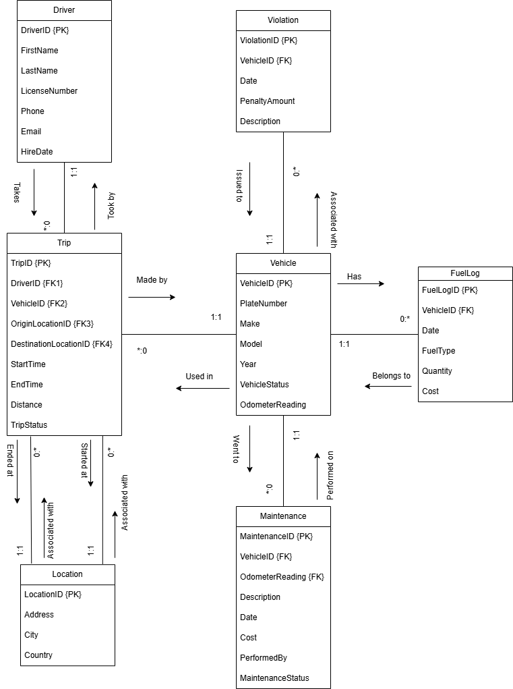

# Fleet Management System – Logical Schema & Components

## **Logical Schema**

The Fleet Management System database is designed to manage and track drivers, vehicles, trips, and related operations efficiently.

The system is composed of the following main entities:

* **Drivers**
* **Vehicles**
* **Trips**
* **Locations**
* **Fuel Logs**
* **Maintenance Records**
* **Violations**

### **Entity Overview**

```
Driver (DriverID, FirstName, LastName, LicenseNumber, Phone, Email, HireDate)
Vehicle (VehicleID, PlateNumber, Make, Model, Year, VehicleStatus, OdometerReading)
Trip (TripID, DriverID, VehicleID, OriginLocationID, DestinationLocationID, StartTime, EndTime, Distance, TripStatus)
Location (LocationID, Address, City, Country)
FuelLog (FuelLogID, VehicleID, Date, FuelType, Quantity, Cost)
Maintenance (MaintenanceID, VehicleID, Description, Date, Cost, PerformedBy, MaintenanceStatus)
Violation (ViolationID, VehicleID, Date, Description, PenaltyAmount)
```
---

## ERD


---

## **Components Identification**

Below is a detailed description of each entity and its attributes:

---

### **1. Driver**

* **DriverID**: Unique identifier for each driver. *(Primary Key)*
* **FirstName**: The driver’s first name.
* **LastName**: The driver’s last name.
* **LicenseNumber**: Official driver license number. *(Unique)*
* **Phone**: Contact phone number.
* **Email**: Contact email address.
* **HireDate**: The date when the driver was hired by the company.

---

### **2. Vehicle**

* **VehicleID**: Unique identifier for each vehicle. *(Primary Key)*
* **PlateNumber**: Vehicle license plate number. *(Unique)*
* **Make**: Vehicle manufacturer (e.g., Toyota, Ford).
* **Model**: Vehicle model (e.g., Camry, Focus).
* **Year**: Manufacturing year.
* **VehicleStatus**: Current status of the vehicle. *(e.g., Available, In Maintenance, In Trip, Unavailable)*
* **OdometerReading**: Total distance the vehicle has traveled (in kilometers).

---

### **3. Trip**

* **TripID**: Unique identifier for each trip. *(Primary Key)*
* **DriverID**: Reference to the driver assigned to the trip. *(Foreign Key)*
* **VehicleID**: Reference to the vehicle used for the trip. *(Foreign Key)*
* **OriginLocationID**: Reference to the starting location. *(Foreign Key)*
* **DestinationLocationID**: Reference to the destination location. *(Foreign Key)*
* **StartTime**: Date and time when the trip started.
* **EndTime**: Date and time when the trip ended.
* **Distance**: Total distance traveled during the trip.
* **TripStatus**: Current trip status. *(e.g., Ongoing, Completed, Canceled)*

---

### **4. Location**

* **LocationID**: Unique identifier for each location. *(Primary Key)*
* **Address**: Street address of the location.
* **City**: City where the location is found.
* **Country**: Country where the location is located.

---

### **5. Fuel Log**

* **FuelLogID**: Unique identifier for each fuel log entry. *(Primary Key)*
* **VehicleID**: Reference to the vehicle being refueled. *(Foreign Key)*
* **Date**: Date of refueling.
* **FuelType**: Type of fuel. *(e.g., Gasoline, Diesel, Electric)*
* **Quantity**: Amount of fuel added (in liters).
* **Cost**: Total cost of the refueling.

---

### **6. Maintenance**

* **MaintenanceID**: Unique identifier for each maintenance record. *(Primary Key)*
* **VehicleID**: Reference to the maintained vehicle. *(Foreign Key)*
* **Description**: Brief description of maintenance work.
* **Date**: Date when the maintenance occurred.
* **Cost**: Cost of the maintenance service.
* **PerformedBy**: Name of the company or person who performed the maintenance.
* **MaintenanceStatus**: Current maintenance status. *(e.g., Ongoing, Completed, Canceled)*

---

### **7. Violation**

* **ViolationID**: Unique identifier for each violation record. *(Primary Key)*
* **VehicleID**: Reference to the vehicle involved in the violation. *(Foreign Key)*
* **Date**: Date of the violation.
* **Description**: Description of the violation. *(e.g., speeding, illegal parking)*
* **PenaltyAmount**: Monetary penalty imposed for the violation.


